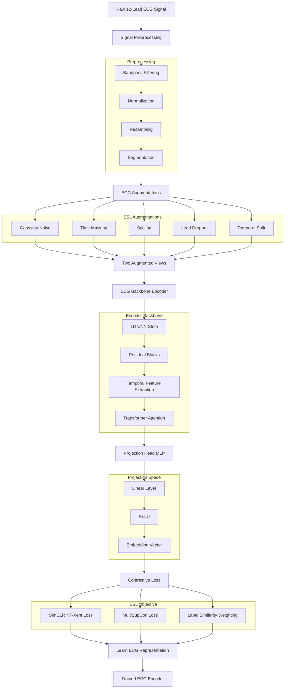
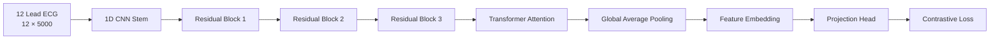

# ECG Multimodal Foundation Model Project

## 1. Complete Project Architecture (High-Level)

```mermaid
flowchart LR

    subgraph DATA[Multimodal Medical Data]
        ECG[ECG Signals<br/>PTB-XL / Chapman / Custom ECG]
        IMG[Chest X-Ray Images<br/>CheXpert / MIMIC-CXR]
        TAB[Clinical Tabular Data<br/>Age / Sex / Vitals / Labs]
    end

    subgraph PREPROCESS[Preprocessing & Augmentation]
        ECG_PRE[ECG Processing<br/>Filtering / Resampling / Augmentations]
        IMG_PRE[Image Processing<br/>Resize / Normalize / Augmentations]
        TAB_PRE[Tabular Processing<br/>Missing Value Handling / Encoding]
    end

    subgraph ENCODERS[Self-Supervised Encoders]
        ECG_ENC[ECG Encoder<br/>1D CNN + ResNet + Transformer]
        IMG_ENC[Image Encoder<br/>ResNet / ViT / DenseNet]
        TAB_ENC[Tabular Encoder<br/>MLP / FT-Transformer]
    end

    subgraph SSL[Self-Supervised Learning]
        ECG_SSL[SimCLR / MultiSupCon<br/>Contrastive Learning]
        IMG_SSL[MoCo / SimCLR / DINO]
        TAB_SSL[Feature Reconstruction / Contrastive]
    end

    subgraph LATENT[Latent Representation Space]
        ECG_EMB[ECG Embedding]
        IMG_EMB[Image Embedding]
        TAB_EMB[Tabular Embedding]
    end

    subgraph FUSION[Multimodal Fusion]
        CROSS[Cross Attention / Fusion Transformer]
        ALIGN[Representation Alignment]
    end

    subgraph TASKS[Downstream Tasks]
        CLS[Diagnosis Classification]
        RETRIEVAL[ECG ↔ X-Ray Retrieval]
        RISK[Risk Prediction]
        REPORT[Clinical Decision Support]
    end

    subgraph TRAINING[Experiment Tracking & Deployment]
        MLFLOW[MLflow Tracking]
        CICD[CI/CD Pipeline]
        DOCKER[Docker + CUDA]
        API[Inference API]
    end

    ECG --> ECG_PRE
    IMG --> IMG_PRE
    TAB --> TAB_PRE

    ECG_PRE --> ECG_SSL
    IMG_PRE --> IMG_SSL
    TAB_PRE --> TAB_SSL

    ECG_SSL --> ECG_ENC
    IMG_SSL --> IMG_ENC
    TAB_SSL --> TAB_ENC

    ECG_ENC --> ECG_EMB
    IMG_ENC --> IMG_EMB
    TAB_ENC --> TAB_EMB

    ECG_EMB --> CROSS
    IMG_EMB --> CROSS
    TAB_EMB --> CROSS

    CROSS --> ALIGN

    ALIGN --> CLS
    ALIGN --> RETRIEVAL
    ALIGN --> RISK
    ALIGN --> REPORT

    CLS --> MLFLOW
    RETRIEVAL --> MLFLOW
    RISK --> MLFLOW

    MLFLOW --> CICD
    CICD --> DOCKER
    DOCKER --> API
```



---

# 2. Recommended Final System Architecture

## Stage 1 — Individual SSL Pretraining

You first train each encoder independently.

```text
ECG Data  ──► ECG SSL Encoder Training
X-Ray Data ─► Image SSL Encoder Training
Tabular ───► Tabular Encoder Training
```

Goal:

- Learn modality-specific representations.
- Avoid requiring paired data initially.
- Build strong foundation encoders.

---

## Stage 2 — Multimodal Alignment

```text
ECG Embedding
                 ┐
Image Embedding ─┼──► Shared Latent Space
                 │
Tabular Embedding┘
```

Goal:

- Bring all modalities into one semantic space.
- Similar diseases become close together.
- ECG and X-ray can understand related pathology.

Example:

- ECG Hypertrophy ↔ Cardiomegaly X-ray
- MI ECG ↔ Pulmonary edema X-ray

---

## Stage 3 — Fusion Learning

```text
ECG Features
X-ray Features ─► Cross Attention Fusion ─► Unified Patient Representation
Tabular Features
```

Goal:

- Combine all modalities.
- Allow modalities to attend to each other.
- Learn patient-level understanding.

---

## Stage 4 — Downstream Tasks

```text
Unified Representation
        │
        ├──► Disease Classification
        ├──► Mortality Prediction
        ├──► ECG ↔ X-ray Retrieval
        ├──► Zero-shot Prediction
        └──► Clinical Decision Support
```

---

# 3. ECG Encoder Flowchart (Detailed)




---

# 4. ECG Encoder Internal Architecture




---

# 5. Recommended Folder Architecture

```text
ecg-multimodal-foundation/
│
├── data/
│   ├── raw/
│   ├── processed/
│   └── external/
│
├── configs/
│   ├── ecg/
│   ├── image/
│   ├── fusion/
│   └── training/
│
├── src/
│   ├── datasets/
│   ├── preprocessing/
│   ├── augmentations/
│   ├── models/
│   │   ├── ecg/
│   │   ├── image/
│   │   ├── tabular/
│   │   └── fusion/
│   │
│   ├── ssl/
│   │   ├── simclr/
│   │   ├── multisupcon/
│   │   └── losses/
│   │
│   ├── training/
│   ├── evaluation/
│   ├── inference/
│   └── utils/
│
├── experiments/
│   ├── notebooks/
│   └── logs/
│
├── mlruns/
│
├── checkpoints/
│   ├── ecg/
│   ├── image/
│   └── fusion/
│
├── docker/
├── tests/
├── requirements.txt
├── environment.yml
└── README.md
```

---

# 6. Best Training Order For Your Project

## Phase 1

Train ECG SSL encoder.

## Phase 2

Train ECG classifier on frozen encoder.

## Phase 3

Improve ECG encoder.

## Phase 4

Train image SSL encoder.

## Phase 5

Train image classifier.

## Phase 6

Create tabular encoder.

## Phase 7

Multimodal alignment training.

## Phase 8

Cross-modal fusion training.

## Phase 9

Clinical downstream tasks.

## Phase 10

Deployment + API + inference optimization.

---

# 7. Most Important Research Contribution

Your strongest contribution can become:

## Cross-modal cardiac representation learning

Meaning:

- ECG and X-ray understand the same pathology.
- Shared semantic disease space.
- Foundation model for cardiology.

This is significantly more advanced than only classification.

---

# 8. Recommended Final Model Stack


| Component       | Recommended Architecture    |
| --------------- | --------------------------- |
| ECG Encoder     | ResNet1D + Transformer      |
| ECG SSL         | MultiSupCon + SimCLR        |
| Image Encoder   | DenseNet121 / ViT           |
| Image SSL       | DINO / SimCLR               |
| Tabular Encoder | FT-Transformer              |
| Fusion          | Cross Attention Transformer |
| Alignment Loss  | Contrastive Alignment       |
| Tracking        | MLflow                      |
| Deployment      | FastAPI + Docker            |
| GPU             | CUDA                        |


---

# 9. Final Recommended Vision

You are essentially building:

## A multimodal cardiology foundation model

that learns:

- ECG understanding
- Radiology understanding
- Clinical feature understanding
- Cross-modal medical semantics
- Unified patient representations

This is research-level architecture closer to:

- Google Health
- Stanford AIMI
- Microsoft BioMed models
- MedCLIP-style systems
- Multimodal medical foundation models

```


